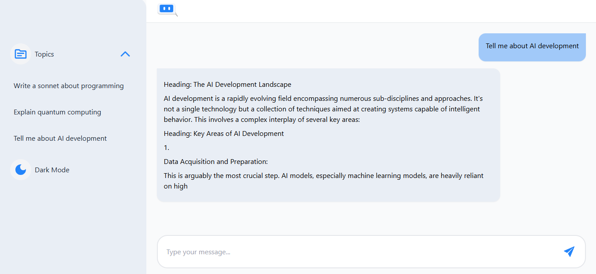

# ChatRoomAzureAI

## Overview

**ChatRoomAzureAI** is a real-time chat application extended from the open-source project  
[loadsmile](https://github.com/limatainer/ChatRoomAzureAI.git).

The original project had chat functionality working, but when you fork it you must configure your own API key.  
In my customized version, I implemented **Google AI Studio API integration**, redesigned the **UI with Tailwind CSS**,  
and deployed both the frontend and backend to production.

---

## My Contributions

- **UI/UX Redesign** using **Tailwind CSS** for a modern, responsive look.
- **AI Integration**:
  - Obtained and configured my own **Google AI Studio API key**.
  - Wired up the backend and frontend to enable AI-powered chat responses.
  - Configured `.env.production` for Vite builds in the frontend.
- Deployment:
  - Backend → Render: [https://chatroomazureai.onrender.com](https://chatroomazureai.onrender.com)
  - Frontend → GitHub Pages: [https://winnie-waiguru.github.io/ChatRoomAzureAI](https://winnie-waiguru.github.io/ChatRoomAzureAI)

## Original Features (from base project)

- Role-Based Access: `User`, `Agent`, `Supervisor`.
- Real-Time Messaging with **Socket.io**.
- Private Messaging between Agents & Supervisors.
- Multi-Language Support for users.
- Mobile-Responsive Layout.

## Screenshots

### Current Version (Tailwind + Gemini AI)



## Installation & Setup

1. Clone the repository:

   ```bash
   git clone https://github.com/Winnie-Waiguru/ChatRoomAzureAI.git
   cd ChatRoomAzureAI
   cd <frontweb>
   cd <server>
   ```

2. Install dependencies:

   ```bash
   for server npm install
   for frontweb npm install
   ```

3. Set up the environment variables:

   ```plaintext
   for server GEMINI_API_KEY=your_google_api_key_here
   for frontweb VITE_API_BASE_URL=https://chatroomazureai.onrender.com
   ```

4. Start the development server and frontend:

   ```bash
   npm start and npm run dev
   ```

## Technologies Used

- **React**: For building the user interface.
- **Socket.io**: For real-time communication.
- **Tailwind CSS**: For styling components.
- **JavaScript/TypeScript**: For application logic.
